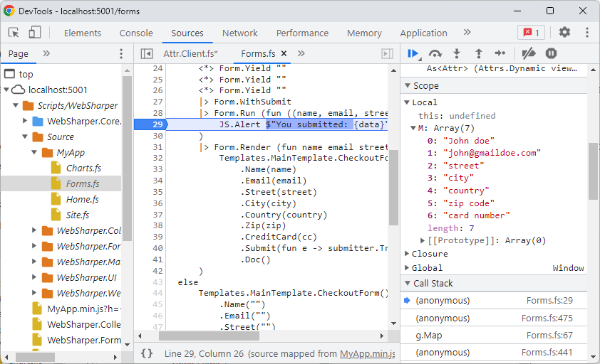
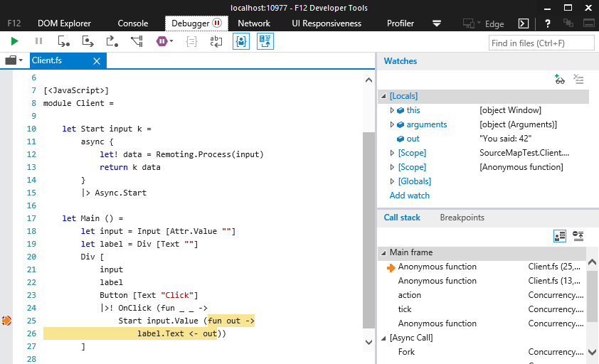

# Debugging your client-side with source maps

Source maps enable mapping transpiled JavaScript code back to the original source files that produced it. With source maps, you can debug your applications and use breakpoints in them using your original source files inside your browser.

!!! danger Source maps in release mode
When you enable source maps in a project, your F# source files will be bundled into it. Therefore, it is strongly advised that you disable source maps in release mode.
!!!

---

## Embedding source maps in WebSharper libraries

You can enable generating source maps and bundling your source files in a WebSharper assembly by adding `"sourceMap": true` to the project's `wsconfig.json`:

```json #4
{
  "project": "site",
  "outputDir": "wwwroot",
  "sourceMap": true,
  "downloadResources": true
}
```

Alternatively, you can add also the `WebSharperSourceMap` property to your project file:

```xml #2
<PropertyGroup>
    <WebSharperSourceMap>True</WebSharperSourceMap>
</PropertyGroup>
```

WebSharper itself is built with source maps, so you can debug into WebSharper library code as well as your user code.

Source maps are supported in full-stack applications, single-page applications (SPAs), and static HTML+JavaScript applications (offline sitelets).

---

## Usage

Next to enabling source maps in your application project, you need to enable working with source maps in your browser as well.

---

### Google Chrome & Microsoft Edge Chromium

Press `Ctrl + Shift + I` to open Developer Tools, click on the cog icon to bring up Settings, and check the "Enable JavaScript source maps" setting.

In the Sources tab, open the `Scripts/WebSharper` folder to load the available source mappings. A folder named `Source` will appear with the original `.fs` files. You can open these files and set breakpoints in them just like in your IDE.



---

### Mozilla Firefox

To enable source maps, press `Ctrl + Shift + I` to open the Web Developer Tools, then press F1 for Settings,
and check the "Enable Source Maps" item in the "Advanced Settings" section.

In the Debugger tab of Web Developer Tools, open the `Scripts/WebSharper` folder to load the source mappings. A folder named `Source` will appear with the original `.fs` files.

You can access the original sources, however, breakpoints don't work correctly as of version 108.0.1.

---

### Internet Explorer & Microsoft Edge Legacy

You need to have Internet Explorer 11 on Windows 8.1 Update 1, or newer, for source map support. Edge has inherited the debugging tool from IE11, and works similarly.

In the Debugger tab of F12 tools, the last icon in the toolbar says "Load the sources mapped to this generated file". Use this to jump between generated and original source code. You can set breakpoints in the original code.



---

## Outputting source maps for WebSharper web projects

If you have a separate web project hosting your WebSharper application,
add the same `WebSharperSourceMap` property to the project file to unpack
the source map files.
