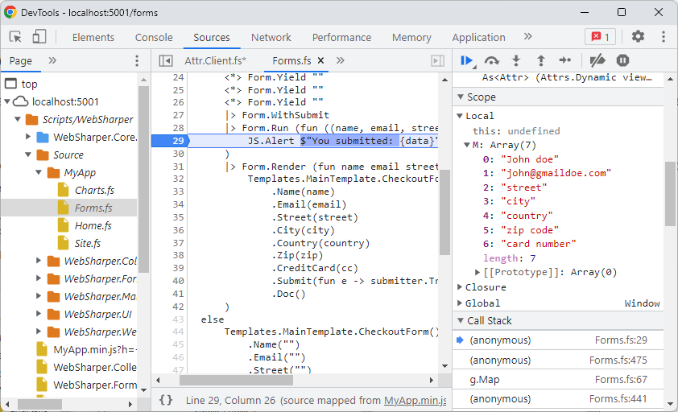

# Client-side debugging with Source Maps

## Sourcemap

Source maps are a way to map a combined/minified file back to the original source files.
You can access the source, from within a browser, and set a breakpoint.

## Embedding source maps in WebSharper libraries

For WebSharper 4.2+ projects, you can enable including source maps and the required source files in a WebSharper assembly, by adding `"sourceMap": true` to wsconfig.json.

Here is an example of wsconfig.json:

```
{
  "project": "site",
  "outputDir": "wwwroot",
  "sourceMap": true,
  "downloadResources": true
}
```

For older versions, you can add the `WebSharperSourceMap` property to your project file.

Here is a .csproj / .fsproj sample:
```
<PropertyGroup>
    <WebSharperSourceMap>True</WebSharperSourceMap>
</PropertyGroup>
```

WebSharper itself is built with source map embedding, so you can debug into
WebSharper library code.

Sitelets and single-page application projects are supported, offline sitelets 
(generating static Html+JS output) is currently not.

## Usage

### Google Chrome & Microsoft Edge Chromium

To enable source maps, press `crtl + shift + i` to open the developer tools,
click the cog icon and check the "Enable JavaScript source maps" 
setting.

In the Sources tab of Developer Tools, open the `Scripts/WebSharper`
folder to load the source mappings.
A folder named `Source` will appear with the original `.fs` files used
for WebSharper translation.
You can use this to set breakpoints in original code.



### Mozilla Firefox

To enable source maps, press `crtl + shift + i` to open the Web Developer Tools, then press F1 for settings,
check the "Enable Source Maps" item in the "Advanced Settings" section.

In the Debugger tab of Web Developer Tools, open the `Scripts/WebSharper`
folder to load the source mappings.
A folder named `Source` will appear with the original `.fs` files used
for WebSharper translation.

You can access the list of original sources, however breakpoints
don't work correctly as of version 108.0.1.

### Internet Explorer & Microsoft Edge Legacy

You need to have Internet Explorer 11 on Windows 8.1 Update 1 or newer
for source map support.
Edge has inherited the debugging tool from IE11, works similarly.

In the Debugger tab of F12 tools, the last icon in the toolbar says
"Load the sources mapped to this generated file".
Use this to jump between generated and original source code.
You can set breakpoints in the original code.


## Outputting source maps for WebSharper web projects

If you have a separate web project hosting your WebSharper application,
add the same `WebSharperSourceMap` property to the project file to unpack
the source map files.